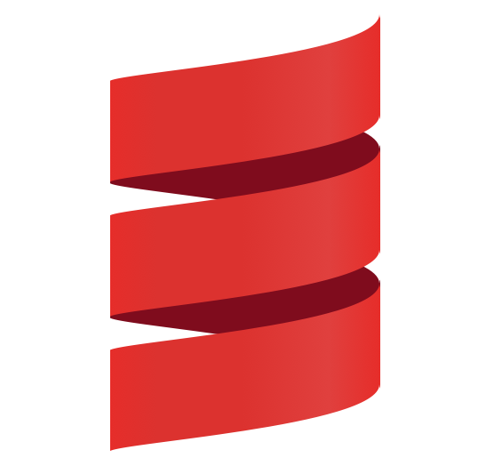
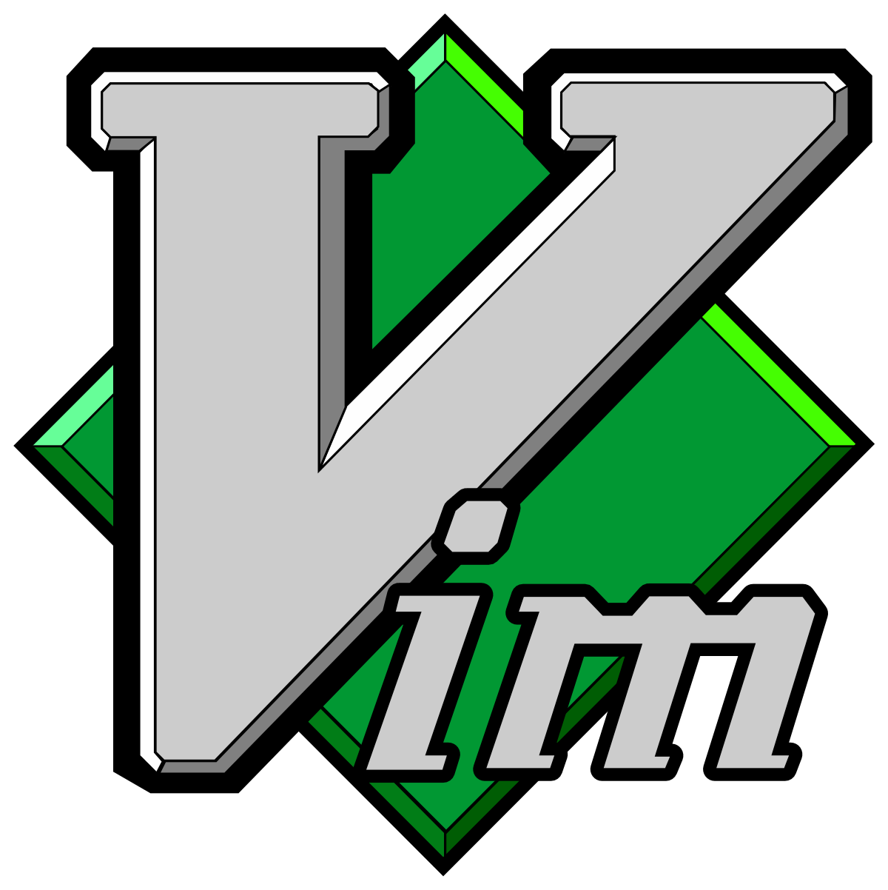

### Hi, I'm Metougui Taha

<!--
**Silverest12/Silverest12** is a ✨ _special_ ✨ repository because its `README.md` (this file) appears on your GitHub profile.

Here are some ideas to get you started:

- 🔭 I’m currently working on ...
- 🌱 I’m currently learning ...
- 👯 I’m looking to collaborate on ...
- 🤔 I’m looking for help with ...
- 💬 Ask me about ...
- 📫 How to reach me: ...
- 😄 Pronouns: ...
- ⚡ Fun fact: ...
-->

I'm a computer science student and I don't know what I'm doing.
But I'm particularly talented at making spaghetti code, Oh wait, that means I don't what I'm doing oh well...

## Reach me :
📫 Gmail: <a href="t.metougui@gmail.com">t.metougui@gmail.com</a>
Or here's <a href="https://www.linkedin.com/in/taha-metougui">LinkedIn</a>

## I can code in :

 
 

## And At the moment learning 

## For Editors I use this bad boys:

  
  

